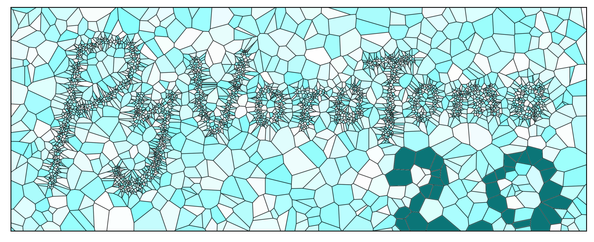

# Welcome to the *PyVoroTomo* (version 2) repository!

This is a moderately revamped version of the original PyVoroTomo by Fang et al. (2020). This code implements a Poisson Voronoi-based seismic traveltime tomography method, primarily suited for regional or smaller study areas but may also be expanded to do joint teleseismic inversions. PyKonal (White et al., 2020) is used for calculating traveltimes and tracing rays.

## Documentation
# Installation
Easiest to clone into your directory ($ git pull https://github.com/filefolder/PyVoroTomo.git )
and install locally via pip, `$ python -m pip install ./PyVoroTomo` which will install the **pyvorotomo** executable

See also: [https://github.com/malcolmw/PyVoroTomo/wiki/Installation](https://github.com/malcolmw/PyVoroTomo/wiki/Installation)

# Running
Depending on your model complexity and catalog size, it may be best to run via openmpi.

`$ mpiexec -n 56 pyvorotomo -r -c experiment.cfg ./catalog.h5 ./stations.h5 -s /dev/shm`

parameters:

-n number of CPU 
-r relocate catalog first (highly recommended) 
-c /path/to/configfile.cfg 
-o output directory (default is ./output_YYYYMMDDTHHMMSSS) 
-l logfile (default is outputdirectory/pyvorotomo.log) 
-s scratch dir (recommend /dev/shm or some other ram partition for speed) 
-t only run the sensitivity test 
-v enable verbose/debug logging 
-x output all realizations 

OTHERWISE, simply run via `$ pyvorotomo -r -c experiment.cfg ./catalog.h5 ./stations.h5 -s /dev/shm`

Python3.14 is also recommended for individual multicore machines (supported soon! instructions then!) 

# Config File
see examples for available options, explanations and recommendations!

## Code Structure

**bin**: Where the python executable **pyvorotomo** lives 
**pyvorotomo**: Module code. The main one you probably want to look at is _iterator.py 
**scripts**: Some tools to generate stations.h5, catalog.h5, and other common tasks (work in progress) 
**synth_data**: Some synthetic data to experiment with 
**test_data**: Some example real-world data 

## Citation
If you make use of this code in published work, please cite the below (more soon hopefully :)

## Installation (previous version)
Refer to [https://github.com/malcolmw/PyVoroTomo/wiki/Installation](https://github.com/malcolmw/PyVoroTomo/wiki/Installation) for both laptops and clusters.

## References
1. Fang, H., van der Hilst, R. D., de Hoop, M. V., Kothari, K., Gupta, S., & Dokmanić, I. (2020). Parsimonious seismic tomography with Poisson Voronoi projections: Methodology and validation. Seismological Research Letters, 91(1), 343-355.
2. White, M. C. A., Fang, H., Nakata, N., & Ben-Zion, Y. (2020). PyKonal: A Python Package for Solving the Eikonal Equation in Spherical and Cartesian Coordinates Using the Fast Marching Method. *Seismological Research Letters, 91*(4), 2378-2389. https://doi.org/10.1785/0220190318
